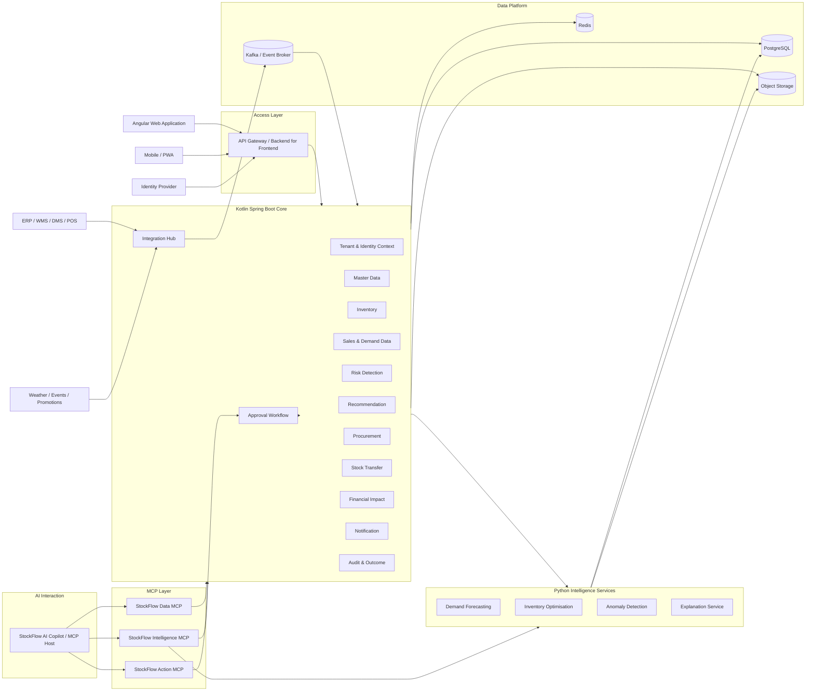
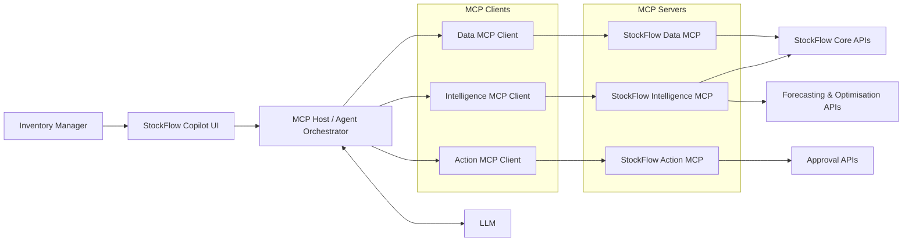
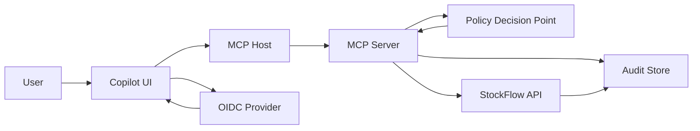
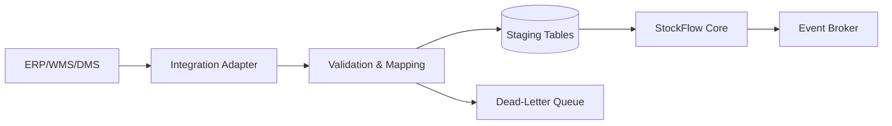
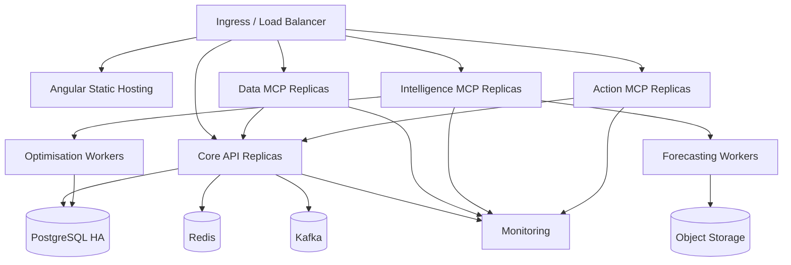

# StockFlow AI — Backend and MCP Technical Architecture

**Document type:** Technical architecture and developer handoff  
**Target solution:** AI-powered demand forecasting, inventory optimisation, expiry reduction and stock rebalancing platform  
**Primary users:** Demand planners, inventory managers, warehouse managers, purchase managers, finance teams and supply-chain heads  
**Initial deployment recommendation:** Pharmaceutical distribution prototype, extensible to supermarket, FMCG and general merchandise  
**Recommended backend stack:** Kotlin + Spring Boot, PostgreSQL, Redis and Python AI services  
**Recommended MCP transport:** Stateless Streamable HTTP for deployed environments; `stdio` only for local development

---

## 1. Purpose

This document defines the proposed:

1. Backend architecture
2. Domain and service boundaries
3. Database structure
4. REST API structure
5. AI/ML service structure
6. MCP host, client and server structure
7. MCP tools, resources and prompts
8. Security and approval controls
9. Deployment topology
10. Repository and package organisation
11. Observability and testing strategy
12. Hackathon implementation scope

The objective is to provide sufficient structure for frontend, backend, AI/ML, DevOps, QA and integration engineers to implement a working prototype without over-engineering the first version.

---

## 2. Architectural Positioning

StockFlow AI is not intended to replace the customer's ERP, Distributor Management System, Warehouse Management System or Point-of-Sale system.

It should operate as an:

> **ERP-neutral inventory intelligence, optimisation and controlled-action layer.**

The existing operational systems remain the systems of record for:

- Product masters
- Warehouses
- Inventory balances
- Sales orders
- Purchase orders
- Goods receipts
- Dispatches
- Returns
- Financial postings
- Tax invoices

StockFlow AI performs:

- Data ingestion and normalisation
- Demand forecasting
- Stockout prediction
- Near-expiry identification
- Excess-inventory identification
- Inventory rebalancing
- Purchase-versus-transfer comparison
- Working-capital calculations
- Explainable recommendation generation
- Approval workflow
- Outcome measurement

MCP is used to expose selected data and capabilities to an AI copilot. MCP does **not** replace transactional APIs, event streaming, ETL pipelines or the core backend.

---

## 3. Key Architecture Decisions

| Decision | Recommendation | Rationale |
|---|---|---|
| Prototype backend | Modular monolith | Faster implementation and simpler debugging |
| Production evolution | Extract high-load services gradually | Avoid premature microservices |
| Core business language | Kotlin | Strong fit with Spring Boot and concise domain modelling |
| AI/ML language | Python | Strong forecasting, optimisation and data-science ecosystem |
| Primary database | PostgreSQL | Transactions, analytics support and mature ecosystem |
| Cache | Redis | Forecast/result caching, distributed locks and idempotency |
| Eventing | Kafka or compatible broker | Use when asynchronous scale is required |
| Object storage | S3-compatible storage | Model artefacts, imports, exports and reports |
| API approach | REST + OpenAPI | Application-to-application integration |
| AI tool access | MCP | Standardised access for AI hosts and agents |
| Remote MCP transport | Stateless Streamable HTTP | Suitable for scalable deployed services |
| Local MCP transport | `stdio` | Simple local development and testing |
| Authorisation | OAuth2/OIDC + policy engine | Central authentication and fine-grained authorisation |
| High-value actions | Human approval mandatory | Prevent autonomous commercial execution |
| Tenant isolation | Tenant ID in every business record | Required for multi-tenant SaaS |
| Recommendation storage | Persist every recommendation | Auditability and model learning |
| AI explainability | Mandatory business-readable reason | Trust and jury demonstration |

---

# Part I — Backend Architecture

## 4. High-Level System Architecture



---

## 5. Prototype Architecture Versus Production Architecture

### 5.1 Hackathon Prototype

Use a modular monolith with clearly separated packages:

```text
Angular UI
    |
Spring Boot Kotlin API
    |
    +-- Inventory module
    +-- Forecast orchestration module
    +-- Recommendation module
    +-- Approval module
    +-- Finance module
    +-- Integration simulator
    |
Python forecasting and optimisation service
    |
PostgreSQL
```

Advantages:

- Faster development
- One deployment for core business logic
- Easier debugging
- Lower infrastructure overhead
- Clear path to future extraction

### 5.2 Production Evolution

Extract only services that require independent scaling or specialist ownership:

- Forecasting service
- Optimisation service
- Data-ingestion service
- Notification service
- MCP gateway/server modules
- Reporting/analytics service

Do not split every domain into a microservice during the prototype.

---

## 6. Backend Bounded Contexts

## 6.1 Tenant and Organisation Context

Responsibilities:

- SaaS tenant registration
- Organisation configuration
- Business vertical
- Country, currency and timezone
- Warehouse and branch hierarchy
- Tenant-level feature flags
- Data-isolation enforcement
- Tenant-specific model configuration

Core entities:

```text
Tenant
Organisation
BusinessUnit
Region
Warehouse
Branch
FeatureFlag
TenantConfiguration
```

---

## 6.2 Identity and Access Context

Responsibilities:

- User identity mapping
- Role assignment
- Warehouse and region scope
- Approval limit
- Segregation of duties
- Delegation
- Access decision audit

Core entities:

```text
User
Role
Permission
UserRole
UserScope
ApprovalLimit
Delegation
AccessDecisionLog
```

Recommended external components:

- OIDC-compliant identity provider
- Policy decision engine such as Cerbos or an equivalent service
- JWT validation in the gateway and backend

---

## 6.3 Product and Master Data Context

Responsibilities:

- Product and SKU master
- Product hierarchy
- Unit of measure
- Batch/lot configuration
- Shelf-life policy
- Substitution rules
- Storage requirements
- Supplier and retailer master
- Lead-time master
- Product criticality

Core entities:

```text
Product
SKU
ProductCategory
UnitOfMeasure
BatchPolicy
ShelfLifePolicy
SubstitutionRule
StorageCondition
Supplier
Retailer
SupplierProduct
RetailerProduct
LeadTimePolicy
```

---

## 6.4 Inventory Context

Responsibilities:

- Current stock
- Available, reserved and blocked inventory
- Batch and lot balances
- Expiry dates
- Inventory movements
- Stock ageing
- Safety stock
- Negative inventory detection
- Inventory snapshots

Core entities:

```text
InventoryBalance
BatchInventory
InventoryMovement
InventoryReservation
InventorySnapshot
StockAgeBucket
SafetyStockPolicy
InventoryAdjustment
```

Important rule:

> Current inventory must come from a trusted operational source or a controlled synchronisation process. StockFlow AI must not silently invent or directly alter stock balances.

---

## 6.5 Sales and Demand Context

Responsibilities:

- Historical sales
- Orders
- Dispatches
- Returns
- Lost sales
- Stockout history
- Promotion history
- Retailer sell-through
- External demand signals

Core entities:

```text
SalesTransaction
SalesOrder
Dispatch
ProductReturn
LostSale
StockoutEvent
Promotion
RetailerSellThrough
DemandSignal
ExternalEvent
WeatherObservation
```

---

## 6.6 Forecasting Context

Responsibilities:

- Forecast request management
- Feature preparation
- Model selection
- Forecast generation
- Confidence interval
- Forecast versioning
- Forecast accuracy
- Forecast explanation
- Model drift monitoring

Core entities:

```text
ForecastRun
ForecastSeries
ForecastPoint
ForecastModel
ForecastMetric
ForecastFeature
ModelVersion
ModelDriftEvent
```

Forecast dimensions:

```text
Tenant
Warehouse
Retailer
SKU
Batch where applicable
Day / week / month
Promotion state
Region
```

---

## 6.7 Inventory Risk Context

Responsibilities:

- Stockout risk
- Overstock risk
- Near-expiry risk
- Slow-moving inventory
- Dead stock
- Duplicate purchase order
- Abnormal return
- Inventory anomaly
- Priority scoring

Core entities:

```text
RiskCase
RiskType
RiskEvidence
RiskScore
RiskStatus
RiskAssignment
RiskResolution
```

Recommended risk score:

```text
Risk Score =
    Probability of occurrence
    × Financial exposure
    × Product criticality
    × Time urgency
```

---

## 6.8 Optimisation Context

Responsibilities:

- Purchase-versus-transfer comparison
- Inter-warehouse rebalancing
- FEFO/FIFO allocation
- Multi-location allocation
- Transfer quantity calculation
- Transfer benefit calculation
- Constraint validation
- Scenario simulation
- Recommendation ranking

Core entities:

```text
OptimisationRun
OptimisationScenario
OptimisationConstraint
CandidateAction
ActionScore
AllocationPlan
TransferPlan
ProcurementPlan
```

Typical constraints:

- Source safety stock
- Destination forecast demand
- Remaining shelf life
- Transportation duration
- Warehouse capacity
- Cold-chain availability
- Territory restrictions
- Tax restrictions
- Vehicle availability
- Purchase order commitments
- Product substitution rules

---

## 6.9 Recommendation Context

Responsibilities:

- Recommendation creation
- Business-readable explanation
- Evidence association
- Confidence and impact
- Recommendation lifecycle
- Recommendation comparison
- User response capture

Core entities:

```text
Recommendation
RecommendationAction
RecommendationEvidence
RecommendationExplanation
RecommendationAlternative
RecommendationDecision
RecommendationOutcome
```

Recommendation states:

```text
DRAFT
GENERATED
PENDING_REVIEW
PENDING_APPROVAL
APPROVED
REJECTED
MODIFIED
EXECUTION_REQUESTED
EXECUTED
FAILED
EXPIRED
MEASURED
```

---

## 6.10 Procurement Context

Responsibilities:

- Reorder quantity
- Reorder date
- Supplier comparison
- Purchase-order duplication check
- PO reduction
- PO postponement
- PO cancellation proposal
- Landed-cost calculation

Core entities:

```text
PurchaseRecommendation
OpenPurchaseOrder
SupplierQuote
LandedCost
ProcurementScenario
PurchaseProposal
```

---

## 6.11 Stock Transfer Context

Responsibilities:

- Source and destination selection
- Transfer proposal
- Batch selection
- Transfer quantity
- Dispatch and receipt tracking
- Inter-company transfer support
- Transfer status
- Transfer outcome

Core entities:

```text
TransferRecommendation
TransferProposal
TransferLine
TransferApproval
TransferDispatch
TransferReceipt
TransferOutcome
```

---

## 6.12 Approval Workflow Context

Responsibilities:

- Approval policy
- Required approvers
- Sequential or parallel approval
- Approval limit
- Delegation
- Rejection reason
- Escalation
- SLA tracking

Core entities:

```text
ApprovalRequest
ApprovalStep
ApprovalDecision
ApprovalPolicy
ApprovalEscalation
ApprovalDelegation
```

Important control:

> The AI agent may create a proposal but may not approve its own proposal.

---

## 6.13 Finance and Working-Capital Context

Responsibilities:

- Inventory value
- Carrying cost
- Days inventory outstanding
- Expected expiry loss
- Expected markdown loss
- Lost-sales estimate
- Transfer cost
- Cash release
- Net recommendation benefit

Core entities:

```text
InventoryValuation
CarryingCostPolicy
FinancialImpact
WorkingCapitalMetric
LossEstimate
BenefitRealisation
```

Example recommendation economics:

```text
Expected Benefit =
    Expiry loss avoided
    + Lost sales recovered
    + Emergency procurement avoided
    + Purchase reduction
    - Transportation cost
    - Handling cost
    - Discount cost
    - Tax and compliance cost
```

---

## 6.14 Integration Context

Responsibilities:

- ERP adapters
- WMS adapters
- DMS adapters
- POS adapters
- Weather and event adapters
- CSV/Excel import
- Data mapping
- Synchronisation status
- Dead-letter and retry handling

Core entities:

```text
IntegrationConnection
IntegrationJob
ExternalRecord
DataMapping
SyncCheckpoint
ImportBatch
IntegrationError
DeadLetterRecord
```

---

## 6.15 Notification Context

Responsibilities:

- Alert delivery
- Approval notification
- Risk escalation
- Daily digest
- Email, mobile and in-app notification
- Optional WhatsApp or SMS integration

Core entities:

```text
Notification
NotificationTemplate
NotificationPreference
DeliveryAttempt
AlertSubscription
```

---

## 6.16 Audit and Outcome Context

Responsibilities:

- Immutable business audit trail
- AI tool-call audit
- Before/after values
- Recommendation outcome
- Model and data version
- User decision reason
- Financial benefit realised

Core entities:

```text
AuditEvent
ToolCallAudit
DataAccessAudit
RecommendationOutcome
OutcomeMetric
ModelDecisionTrace
```

---

## 7. Recommended Technology Stack

| Layer | Technology |
|---|---|
| Web frontend | Angular |
| Mobile prototype | Responsive Angular/PWA |
| API gateway/BFF | Spring Cloud Gateway or Spring Boot BFF |
| Core backend | Kotlin + Spring Boot |
| Persistence | Spring Data JPA or jOOQ |
| Database | PostgreSQL |
| Cache | Redis |
| Asynchronous events | Kafka-compatible broker |
| AI service API | Python + FastAPI |
| Forecasting | statsmodels, Prophet, XGBoost, LightGBM or compatible libraries |
| Optimisation | OR-Tools, Pyomo or scipy.optimize |
| Anomaly detection | scikit-learn |
| Model registry | MLflow or equivalent |
| Object storage | S3-compatible storage |
| API documentation | OpenAPI/Swagger |
| Authentication | OAuth2/OIDC |
| Authorisation | Policy engine or Spring Security rules |
| Observability | OpenTelemetry, Prometheus and Grafana |
| Logs | Structured JSON logs |
| CI/CD | GitLab CI or equivalent |
| Testing | JUnit, MockK/Mockito, Testcontainers, Pact, Postman/Newman, Playwright |
| MCP Java implementation | Official MCP Java SDK / Spring AI MCP |
| MCP Python implementation | Official MCP Python SDK |

---

## 8. Backend Repository Structure

```text
stockflow-ai/
├── README.md
├── docs/
│   ├── architecture/
│   │   ├── backend-architecture.md
│   │   ├── mcp-architecture.md
│   │   ├── data-model.md
│   │   └── security-model.md
│   ├── api/
│   └── demo/
│
├── apps/
│   ├── stockflow-web/
│   └── stockflow-mobile-pwa/
│
├── services/
│   ├── stockflow-core-api/
│   ├── forecasting-service/
│   ├── optimisation-service/
│   ├── anomaly-service/
│   └── integration-simulator/
│
├── mcp/
│   ├── stockflow-data-mcp/
│   ├── stockflow-intelligence-mcp/
│   ├── stockflow-action-mcp/
│   └── stockflow-mcp-test-client/
│
├── libs/
│   ├── api-contracts/
│   ├── event-contracts/
│   ├── domain-common/
│   ├── security-common/
│   └── test-fixtures/
│
├── data/
│   ├── synthetic/
│   ├── seed/
│   └── notebooks/
│
├── infra/
│   ├── local/
│   ├── kubernetes/
│   ├── terraform/
│   ├── monitoring/
│   └── database/
│
└── .gitlab-ci.yml
```

---

## 9. Kotlin Core API Package Structure

```text
com.stockflow
├── StockFlowApplication.kt
├── common/
│   ├── api/
│   ├── errors/
│   ├── events/
│   ├── idempotency/
│   ├── money/
│   ├── observability/
│   └── security/
│
├── tenant/
├── masterdata/
├── inventory/
├── demand/
├── forecasting/
├── risk/
├── optimisation/
├── recommendation/
├── procurement/
├── transfer/
├── approval/
├── finance/
├── notification/
├── integration/
└── audit/
```

Each module should follow:

```text
api/
    Controllers, API DTOs, request validation

application/
    Use cases, orchestration, transaction boundaries

domain/
    Aggregates, entities, value objects, policies, domain events

infrastructure/
    Repositories, external clients, message handlers, persistence mapping
```

Avoid placing business logic in controllers or JPA entities.

---

## 10. Suggested Domain Value Objects

```kotlin
@JvmInline
value class TenantId(val value: UUID)

@JvmInline
value class WarehouseId(val value: UUID)

@JvmInline
value class SkuId(val value: UUID)

@JvmInline
value class BatchId(val value: UUID)

data class Quantity(
    val value: BigDecimal,
    val unit: String
)

data class Money(
    val amount: BigDecimal,
    val currency: Currency
)

data class Confidence(
    val value: BigDecimal
) {
    init {
        require(value >= BigDecimal.ZERO && value <= BigDecimal.ONE)
    }
}
```

---

## 11. Core Database Structure

Every business table should contain, at minimum:

```text
id
tenant_id
created_at
created_by
updated_at
updated_by
version
```

Use optimistic locking for editable transactional records.

### 11.1 Master Data Tables

```text
tenant
organisation
region
warehouse
product_category
product
sku
supplier
retailer
storage_condition
substitution_rule
lead_time_policy
```

### 11.2 Inventory Tables

```text
inventory_balance
batch_inventory
inventory_movement
inventory_reservation
inventory_snapshot
safety_stock_policy
inventory_adjustment
```

### 11.3 Sales and Demand Tables

```text
sales_transaction
sales_order
dispatch
product_return
lost_sale
stockout_event
promotion
retailer_sell_through
demand_signal
external_event
weather_observation
```

### 11.4 Forecasting Tables

```text
forecast_run
forecast_series
forecast_point
forecast_model
forecast_metric
forecast_feature
model_version
model_drift_event
```

### 11.5 Risk and Recommendation Tables

```text
risk_case
risk_evidence
recommendation
recommendation_action
recommendation_evidence
recommendation_alternative
recommendation_decision
recommendation_outcome
```

### 11.6 Procurement and Transfer Tables

```text
open_purchase_order
purchase_recommendation
purchase_proposal
transfer_recommendation
transfer_proposal
transfer_line
transfer_dispatch
transfer_receipt
```

### 11.7 Approval and Audit Tables

```text
approval_request
approval_step
approval_decision
approval_policy
audit_event
tool_call_audit
data_access_audit
```

---

## 12. Example Inventory Table

```sql
CREATE TABLE batch_inventory (
    id UUID PRIMARY KEY,
    tenant_id UUID NOT NULL,
    warehouse_id UUID NOT NULL,
    sku_id UUID NOT NULL,
    batch_number VARCHAR(100) NOT NULL,
    manufacture_date DATE,
    expiry_date DATE,
    available_quantity NUMERIC(18, 4) NOT NULL,
    reserved_quantity NUMERIC(18, 4) NOT NULL DEFAULT 0,
    blocked_quantity NUMERIC(18, 4) NOT NULL DEFAULT 0,
    unit_cost NUMERIC(18, 4),
    currency CHAR(3),
    storage_condition_code VARCHAR(50),
    source_system VARCHAR(50) NOT NULL,
    source_record_id VARCHAR(200),
    last_synced_at TIMESTAMPTZ NOT NULL,
    created_at TIMESTAMPTZ NOT NULL,
    updated_at TIMESTAMPTZ NOT NULL,
    version BIGINT NOT NULL DEFAULT 0,
    UNIQUE (tenant_id, warehouse_id, sku_id, batch_number)
);
```

---

## 13. Example Recommendation Table

```sql
CREATE TABLE recommendation (
    id UUID PRIMARY KEY,
    tenant_id UUID NOT NULL,
    recommendation_type VARCHAR(50) NOT NULL,
    risk_case_id UUID,
    status VARCHAR(50) NOT NULL,
    priority VARCHAR(20) NOT NULL,
    confidence NUMERIC(5, 4),
    explanation TEXT NOT NULL,
    estimated_benefit_amount NUMERIC(18, 2),
    estimated_cost_amount NUMERIC(18, 2),
    net_benefit_amount NUMERIC(18, 2),
    currency CHAR(3),
    model_version VARCHAR(100),
    data_snapshot_id UUID,
    expires_at TIMESTAMPTZ,
    generated_at TIMESTAMPTZ NOT NULL,
    created_by VARCHAR(100) NOT NULL,
    created_at TIMESTAMPTZ NOT NULL,
    updated_at TIMESTAMPTZ NOT NULL,
    version BIGINT NOT NULL DEFAULT 0
);
```

---

## 14. REST API Structure

Base path:

```text
/api/v1
```

### 14.1 Tenant and Master Data

```http
GET    /api/v1/tenants/current
GET    /api/v1/warehouses
GET    /api/v1/warehouses/{warehouseId}
GET    /api/v1/products
GET    /api/v1/skus/{skuId}
GET    /api/v1/suppliers
GET    /api/v1/retailers
```

### 14.2 Inventory

```http
GET    /api/v1/inventory
GET    /api/v1/inventory/summary
GET    /api/v1/inventory/batches
GET    /api/v1/inventory/near-expiry
GET    /api/v1/inventory/excess
GET    /api/v1/inventory/slow-moving
GET    /api/v1/inventory/movements
POST   /api/v1/inventory/imports
```

### 14.3 Forecasting

```http
POST   /api/v1/forecasts
GET    /api/v1/forecasts/{forecastRunId}
GET    /api/v1/forecasts/latest
GET    /api/v1/forecasts/accuracy
POST   /api/v1/forecasts/{forecastRunId}/explain
```

### 14.4 Risks

```http
GET    /api/v1/risks
GET    /api/v1/risks/summary
GET    /api/v1/risks/{riskId}
POST   /api/v1/risks/{riskId}/assign
POST   /api/v1/risks/{riskId}/resolve
```

### 14.5 Recommendations

```http
POST   /api/v1/recommendations/generate
GET    /api/v1/recommendations
GET    /api/v1/recommendations/{recommendationId}
POST   /api/v1/recommendations/{recommendationId}/accept
POST   /api/v1/recommendations/{recommendationId}/modify
POST   /api/v1/recommendations/{recommendationId}/reject
POST   /api/v1/recommendations/{recommendationId}/submit
```

### 14.6 Transfers

```http
POST   /api/v1/transfers/proposals
GET    /api/v1/transfers/proposals
GET    /api/v1/transfers/proposals/{proposalId}
POST   /api/v1/transfers/proposals/{proposalId}/submit
POST   /api/v1/transfers/{transferId}/dispatch
POST   /api/v1/transfers/{transferId}/receive
```

### 14.7 Procurement

```http
POST   /api/v1/procurement/recommendations
GET    /api/v1/procurement/open-orders
POST   /api/v1/procurement/proposals
POST   /api/v1/procurement/proposals/{proposalId}/submit
```

### 14.8 Approvals

```http
GET    /api/v1/approvals/inbox
GET    /api/v1/approvals/{approvalRequestId}
POST   /api/v1/approvals/{approvalRequestId}/approve
POST   /api/v1/approvals/{approvalRequestId}/reject
POST   /api/v1/approvals/{approvalRequestId}/request-change
```

### 14.9 Dashboard

```http
GET    /api/v1/dashboard/kpis
GET    /api/v1/dashboard/risk-overview
GET    /api/v1/dashboard/top-risks
GET    /api/v1/dashboard/demand-forecast
GET    /api/v1/dashboard/inventory-value-trend
GET    /api/v1/dashboard/recommendations
```

---

## 15. UI-to-Backend Mapping

| UI component | Backend API |
|---|---|
| Total Inventory Value | `GET /dashboard/kpis` |
| Stockout Risk | `GET /dashboard/kpis` |
| Near Expiry Value | `GET /dashboard/kpis` |
| Excess Inventory | `GET /dashboard/kpis` |
| Working Capital Blocked | `GET /dashboard/kpis` |
| Inventory Risk Donut | `GET /dashboard/risk-overview` |
| Top Risks | `GET /dashboard/top-risks` |
| Demand Forecast Chart | `GET /dashboard/demand-forecast` |
| Inventory Value Trend | `GET /dashboard/inventory-value-trend` |
| Recommendation Cards | `GET /dashboard/recommendations` |
| StockFlow AI Assistant | MCP host through a secured copilot API |

Example dashboard response:

```json
{
  "asOf": "2026-07-26T10:25:00+05:30",
  "currency": "INR",
  "kpis": {
    "inventoryValue": 248000000,
    "stockoutRiskSkuCount": 128,
    "nearExpiryValue": 36000000,
    "excessInventoryValue": 52000000,
    "workingCapitalBlocked": 187000000
  }
}
```

---

## 16. Event Structure

Recommended domain events:

```text
InventorySnapshotReceived
InventoryBalanceChanged
BatchExpiryRiskDetected
StockoutRiskDetected
ExcessInventoryDetected
ForecastCompleted
ForecastAccuracyCalculated
OptimisationCompleted
RecommendationGenerated
RecommendationSubmitted
RecommendationApproved
RecommendationRejected
TransferProposalCreated
TransferDispatched
TransferReceived
PurchaseProposalCreated
OutcomeMeasured
```

Example event envelope:

```json
{
  "eventId": "0ca42e5a-19a0-4f70-970a-e64f4cc989ea",
  "eventType": "RecommendationGenerated",
  "eventVersion": 1,
  "tenantId": "acme-pharma",
  "correlationId": "f43a48c4-477d-47c8-b55e-803c59569adb",
  "occurredAt": "2026-07-26T10:25:00+05:30",
  "payload": {}
}
```

---

## 17. AI/ML Service Structure

```text
forecasting-service/
├── pyproject.toml
├── src/
│   └── stockflow_forecasting/
│       ├── api/
│       │   ├── routes.py
│       │   └── schemas.py
│       ├── application/
│       │   ├── forecast_use_case.py
│       │   └── explain_use_case.py
│       ├── domain/
│       │   ├── forecast.py
│       │   ├── metrics.py
│       │   └── model_policy.py
│       ├── features/
│       │   ├── lag_features.py
│       │   ├── promotion_features.py
│       │   ├── weather_features.py
│       │   └── calendar_features.py
│       ├── models/
│       │   ├── baseline.py
│       │   ├── arima.py
│       │   ├── gradient_boosting.py
│       │   └── ensemble.py
│       ├── evaluation/
│       │   ├── backtesting.py
│       │   └── metrics.py
│       ├── infrastructure/
│       │   ├── repositories.py
│       │   ├── model_registry.py
│       │   └── storage.py
│       └── config.py
└── tests/
```

### 17.1 Forecast Request

```json
{
  "tenantId": "acme-pharma",
  "warehouseIds": ["WH-CHENNAI", "WH-BENGALURU"],
  "skuIds": ["SKU-PARA-650"],
  "horizonDays": 30,
  "granularity": "DAY",
  "includePromotions": true,
  "includeWeather": true,
  "includeEvents": true
}
```

### 17.2 Forecast Response

```json
{
  "forecastRunId": "fcast-10082",
  "modelVersion": "ensemble-2026-07-01",
  "series": [
    {
      "warehouseId": "WH-BENGALURU",
      "skuId": "SKU-PARA-650",
      "predictedDemand": 1200,
      "lowerBound": 1010,
      "upperBound": 1380,
      "confidence": 0.87,
      "expectedStockoutDate": "2026-08-03"
    }
  ]
}
```

---

## 18. Optimisation Service Structure

```text
optimisation-service/
├── pyproject.toml
├── src/
│   └── stockflow_optimisation/
│       ├── api/
│       ├── application/
│       ├── domain/
│       │   ├── decision.py
│       │   ├── constraint.py
│       │   └── objective.py
│       ├── solvers/
│       │   ├── transfer_solver.py
│       │   ├── procurement_solver.py
│       │   └── markdown_solver.py
│       ├── scoring/
│       │   ├── financial_score.py
│       │   ├── expiry_score.py
│       │   └── service_level_score.py
│       ├── infrastructure/
│       └── config.py
└── tests/
```

### 18.1 Optimisation Objectives

```text
Minimise:
- Expected stockout loss
- Expected expiry loss
- Excess inventory
- Transportation cost
- Procurement cost
- Working capital

Subject to:
- Safety stock
- Shelf life
- Capacity
- Service level
- Territory rules
- Cold-chain rules
- Approval limits
```

---

# Part II — MCP Architecture

## 19. Role of MCP in StockFlow AI

MCP provides a standard interface through which an AI host can discover and call approved StockFlow capabilities.

MCP supports three primary server primitives:

- **Tools:** Executable functions
- **Resources:** Contextual data identified by URIs
- **Prompts:** Reusable interaction templates

In StockFlow AI:

```text
REST APIs and events = application integration
MCP = AI-facing tool and context integration
```

MCP must not be used as:

- A replacement for ERP integration
- A replacement for Kafka
- A replacement for ETL
- A direct database mutation mechanism
- A substitute for approval workflows
- A substitute for authentication or authorisation

---

## 20. MCP Host–Client–Server Structure



---

## 21. Recommended MCP Server Boundaries

For the prototype, implement three logical MCP servers.

## 21.1 StockFlow Data MCP

Purpose:

- Provide trusted read access to inventory, sales, master and risk data
- Hide internal API and database details from the AI host
- Enforce tenant and warehouse scope

Backed by:

- Core backend REST APIs
- Read models
- Cached data
- Integration status APIs

### Tools

```text
get_inventory_summary
get_current_inventory
get_batch_inventory
find_near_expiry_inventory
find_excess_inventory
find_slow_moving_inventory
get_sales_history
get_open_purchase_orders
get_product_returns
get_top_inventory_risks
```

### Resources

```text
stockflow://tenant/{tenantId}/warehouse/{warehouseId}
stockflow://tenant/{tenantId}/sku/{skuId}
stockflow://tenant/{tenantId}/batch/{batchId}
stockflow://tenant/{tenantId}/risk/{riskId}
stockflow://tenant/{tenantId}/recommendation/{recommendationId}
stockflow://tenant/{tenantId}/policy/fefo
```

---

## 21.2 StockFlow Intelligence MCP

Purpose:

- Expose AI and optimisation capabilities
- Return structured evidence, confidence and financial impact
- Avoid allowing the LLM to perform calculations itself when a deterministic service exists

Backed by:

- Forecasting service
- Optimisation service
- Anomaly service
- Financial impact APIs

### Tools

```text
forecast_demand
predict_stockout
calculate_safety_stock
recommend_reorder_quantity
recommend_stock_transfer
compare_purchase_vs_transfer
recommend_fefo_allocation
detect_duplicate_purchase_order
detect_inventory_anomaly
calculate_financial_benefit
simulate_recommendation
explain_recommendation
```

### Resources

```text
stockflow-model://forecast/{forecastRunId}
stockflow-model://optimisation/{optimisationRunId}
stockflow-model://version/{modelVersion}
stockflow-model://metric/{metricName}
```

---

## 21.3 StockFlow Action MCP

Purpose:

- Create controlled business proposals
- Submit proposals for approval
- Retrieve approval status
- Record user feedback
- Never permit unauthorised direct financial execution

Backed by:

- Recommendation API
- Transfer API
- Procurement API
- Approval API
- Audit API

### Tools

```text
create_transfer_proposal
create_purchase_proposal
create_markdown_proposal
submit_recommendation_for_approval
get_approval_status
record_recommendation_modification
record_recommendation_rejection
```

Production-only tools after governance validation:

```text
request_transfer_execution
request_purchase_order_creation
request_purchase_order_change
```

The word `request` is intentional. Execution remains in the transactional backend after authorisation.

---

## 22. MCP Tool Classification

| Classification | Examples | Human confirmation |
|---|---|---:|
| Read-only | Get inventory, sales history, risk list | Usually not required |
| Computational | Forecast demand, simulate transfer | Usually not required |
| Proposal creation | Create transfer/purchase proposal | Recommended |
| Approval submission | Submit recommendation | Required |
| Execution request | Request ERP action | Mandatory |
| Administrative | Change policy/model configuration | Mandatory and restricted |

---

## 23. Tool Naming Standards

Use:

```text
verb_object
```

Good examples:

```text
get_current_inventory
find_near_expiry_inventory
forecast_demand
recommend_stock_transfer
create_transfer_proposal
submit_recommendation_for_approval
```

Avoid:

```text
run
execute
process
do_action
stock_tool
inventory_helper
```

Tool descriptions must state:

1. What the tool does
2. Whether it reads, calculates or creates a proposal
3. Required permissions
4. Whether it has side effects
5. Important limits

---

## 24. Example MCP Tool Contract

### Tool: `find_near_expiry_inventory`

```json
{
  "name": "find_near_expiry_inventory",
  "description": "Returns batch-level inventory expected to expire within the requested number of days. Read-only. Results are restricted to the caller's tenant and warehouse scope.",
  "inputSchema": {
    "type": "object",
    "properties": {
      "warehouseIds": {
        "type": "array",
        "items": {"type": "string"}
      },
      "expiryWithinDays": {
        "type": "integer",
        "minimum": 1,
        "maximum": 365
      },
      "minimumValue": {
        "type": "number",
        "minimum": 0
      },
      "currency": {
        "type": "string"
      },
      "pageSize": {
        "type": "integer",
        "minimum": 1,
        "maximum": 100
      }
    },
    "required": ["expiryWithinDays"]
  }
}
```

Example result:

```json
{
  "asOf": "2026-07-26T10:25:00+05:30",
  "items": [
    {
      "warehouseId": "WH-CHENNAI",
      "skuId": "SKU-PARA-650",
      "batchNumber": "B2456",
      "availableQuantity": 2450,
      "expiryDate": "2026-09-09",
      "daysToExpiry": 45,
      "inventoryValue": 480000,
      "currency": "INR"
    }
  ],
  "nextCursor": null
}
```

---

## 25. Example MCP Optimisation Tool Contract

### Tool: `recommend_stock_transfer`

```json
{
  "name": "recommend_stock_transfer",
  "description": "Calculates a proposed stock transfer using demand forecasts, safety stock, expiry, capacity, travel time and cost. Computational only; it does not create or execute a transfer.",
  "inputSchema": {
    "type": "object",
    "properties": {
      "skuId": {"type": "string"},
      "sourceWarehouseIds": {
        "type": "array",
        "items": {"type": "string"}
      },
      "destinationWarehouseIds": {
        "type": "array",
        "items": {"type": "string"}
      },
      "forecastHorizonDays": {
        "type": "integer",
        "minimum": 1,
        "maximum": 180
      },
      "objective": {
        "type": "string",
        "enum": [
          "MINIMISE_EXPIRY",
          "PREVENT_STOCKOUT",
          "MAXIMISE_NET_BENEFIT",
          "BALANCE_SERVICE_AND_COST"
        ]
      }
    },
    "required": ["skuId", "forecastHorizonDays", "objective"]
  }
}
```

Example result:

```json
{
  "optimisationRunId": "opt-30921",
  "recommendation": {
    "action": "TRANSFER",
    "skuId": "SKU-PARA-650",
    "sourceWarehouseId": "WH-CHENNAI",
    "destinationWarehouseId": "WH-BENGALURU",
    "batchNumber": "B2456",
    "quantity": 900,
    "expectedStockoutPrevented": true,
    "expectedExpiryLossAvoided": 245000,
    "transportCost": 32000,
    "netExpectedBenefit": 213000,
    "currency": "INR",
    "confidence": 0.86
  },
  "constraintsChecked": [
    "SOURCE_SAFETY_STOCK",
    "DESTINATION_CONSUMPTION_BEFORE_EXPIRY",
    "TRANSPORT_DURATION",
    "COLD_CHAIN",
    "WAREHOUSE_CAPACITY"
  ],
  "explanation": "Bengaluru is expected to stock out in eight days. Chennai has excess stock that is unlikely to be consumed before expiry."
}
```

---

## 26. Example MCP Action Tool Contract

### Tool: `create_transfer_proposal`

```json
{
  "name": "create_transfer_proposal",
  "description": "Creates a reviewable transfer proposal from an approved recommendation candidate. This tool has a side effect but does not execute inventory movement.",
  "inputSchema": {
    "type": "object",
    "properties": {
      "recommendationId": {"type": "string"},
      "sourceWarehouseId": {"type": "string"},
      "destinationWarehouseId": {"type": "string"},
      "skuId": {"type": "string"},
      "batchNumber": {"type": "string"},
      "quantity": {"type": "number", "exclusiveMinimum": 0},
      "businessJustification": {"type": "string"},
      "idempotencyKey": {"type": "string"}
    },
    "required": [
      "recommendationId",
      "sourceWarehouseId",
      "destinationWarehouseId",
      "skuId",
      "quantity",
      "businessJustification",
      "idempotencyKey"
    ]
  }
}
```

Example result:

```json
{
  "proposalId": "TRP-2026-000291",
  "status": "DRAFT",
  "requiresApproval": true,
  "approvalPolicy": "PHARMA_INTER_WAREHOUSE_TRANSFER",
  "nextAction": "SUBMIT_FOR_APPROVAL"
}
```

---

## 27. MCP Resource Design

Resources should be read-oriented and URI-addressable.

Examples:

```text
stockflow://tenant/acme/warehouse/WH-CHENNAI
stockflow://tenant/acme/sku/SKU-PARA-650
stockflow://tenant/acme/batch/B2456
stockflow://tenant/acme/recommendation/REC-20341
stockflow://tenant/acme/policy/approval-limits
```

Resource output should include:

- `asOf` timestamp
- Tenant context
- Source system
- Data freshness
- Currency and unit
- Access scope
- Sensitive-field masking

Do not expose:

- Raw database credentials
- Full supplier pricing unless authorised
- Retailer personal data
- Other tenants' information
- Internal tokens
- Hidden model chain-of-thought
- Unfiltered error stack traces

---

## 28. MCP Prompt Templates

Useful prompts:

```text
analyse_inventory_risk
explain_transfer_recommendation
prepare_daily_inventory_brief
compare_procurement_options
summarise_working_capital_opportunities
prepare_approval_note
```

Example prompt definition:

```text
Prompt: prepare_approval_note

Inputs:
- recommendation_id
- audience
- detail_level

Output instructions:
- Summarise the risk
- State the proposed action
- Show evidence
- Show alternatives considered
- Show expected financial benefit
- Show key assumptions
- Identify required approvers
- Avoid claiming execution has occurred
```

Prompts must not embed secrets, static access tokens or unrestricted tenant IDs.

---

## 29. MCP Request Context

Every MCP call should carry or resolve:

```text
request_id
correlation_id
user_id
tenant_id
roles
permissions
warehouse_scope
region_scope
approval_limit
locale
timezone
```

The MCP server must derive trusted identity and permissions from validated authentication context, not from user-supplied tool parameters.

Bad:

```json
{
  "tenantId": "another-company",
  "role": "ADMIN"
}
```

Good:

```text
Tenant and role are obtained from the validated access token.
The tool input only contains the business query.
```

---

## 30. MCP Security Architecture



Required controls:

- TLS for all remote connections
- OAuth2/OIDC access tokens
- Token audience validation
- Short-lived access tokens
- No token passthrough to unrelated downstream systems
- Tenant and warehouse scope enforcement
- Tool-level permissions
- Input schema validation
- Output filtering
- Rate limiting
- Idempotency for write tools
- Full audit logs
- Human confirmation for sensitive actions
- Separation of proposal, approval and execution
- Timeout and circuit-breaker controls
- Secret storage outside source code

---

## 31. Suggested Permissions

```text
inventory:read
inventory:read-sensitive
forecast:execute
forecast:read
risk:read
optimisation:execute
recommendation:read
recommendation:create
recommendation:modify
transfer:propose
transfer:submit
transfer:approve
transfer:execute-request
procurement:propose
procurement:submit
procurement:approve
finance:read
model:admin
tenant:admin
audit:read
```

Example warehouse manager access:

```yaml
tenant: acme-pharma
warehouse_scope:
  - WH-CHENNAI
  - WH-BENGALURU
permissions:
  - inventory:read
  - risk:read
  - forecast:read
  - optimisation:execute
  - recommendation:read
  - transfer:propose
```

---

## 32. Approval-Controlled Action Pattern

```mermaid
sequenceDiagram
    participant U as User
    participant H as MCP Host
    participant I as Intelligence MCP
    participant A as Action MCP
    participant W as Approval Workflow
    participant E as ERP/WMS

    U->>H: Prevent expiry for Batch B2456
    H->>I: recommend_stock_transfer
    I-->>H: Transfer 900 units; net benefit ₹2.13 lakh
    H-->>U: Display evidence and proposed action
    U->>H: Create proposal
    H->>A: create_transfer_proposal
    A->>W: Create approval request
    W-->>A: Pending approval
    A-->>H: Proposal TRP-2026-000291
    H-->>U: Awaiting approval
    W->>E: Execute only after authorised approval
```

The model must not be able to skip the approval workflow.

---

## 33. Complete Copilot Orchestration Example

User asks:

> Which medicines are most likely to expire in the next 90 days, and what should we do?

Recommended orchestration:

```text
1. Data MCP
   find_near_expiry_inventory

2. Intelligence MCP
   forecast_demand for candidate products and locations

3. Intelligence MCP
   recommend_stock_transfer

4. Intelligence MCP
   calculate_financial_benefit

5. Copilot
   Explain evidence, assumptions and alternatives

6. User confirmation

7. Action MCP
   create_transfer_proposal

8. Action MCP
   submit_recommendation_for_approval
```

The response should separate:

- Facts retrieved from systems
- Forecasts
- Optimisation result
- Assumptions
- Recommended action
- Approval status

---

## 34. Kotlin MCP Server Structure

```text
stockflow-data-mcp/
├── build.gradle.kts
├── src/main/kotlin/com/stockflow/mcp/data/
│   ├── DataMcpApplication.kt
│   ├── config/
│   │   ├── McpConfiguration.kt
│   │   ├── SecurityConfiguration.kt
│   │   └── ClientConfiguration.kt
│   ├── tools/
│   │   ├── InventoryTools.kt
│   │   ├── SalesTools.kt
│   │   └── RiskTools.kt
│   ├── resources/
│   │   ├── WarehouseResources.kt
│   │   ├── ProductResources.kt
│   │   └── RecommendationResources.kt
│   ├── prompts/
│   │   └── InventoryPrompts.kt
│   ├── application/
│   │   └── DataQueryService.kt
│   ├── clients/
│   │   └── StockFlowCoreClient.kt
│   ├── security/
│   │   ├── ToolAuthorizer.kt
│   │   └── TenantContext.kt
│   ├── audit/
│   │   └── McpAuditService.kt
│   └── errors/
│       └── McpErrorHandler.kt
└── src/test/
```

Illustrative annotation-based tool:

```kotlin
@Component
class InventoryTools(
    private val inventoryQueryService: InventoryQueryService,
    private val authorizer: ToolAuthorizer
) {
    @McpTool(
        name = "find_near_expiry_inventory",
        description = "Returns near-expiry batch inventory within the authorised tenant and warehouse scope."
    )
    fun findNearExpiryInventory(
        expiryWithinDays: Int,
        warehouseIds: List<String>?
    ): NearExpiryResult {
        authorizer.requirePermission("inventory:read")
        require(expiryWithinDays in 1..365)

        return inventoryQueryService.findNearExpiry(
            expiryWithinDays = expiryWithinDays,
            requestedWarehouses = warehouseIds
        )
    }
}
```

The exact annotation signatures should be aligned to the selected Spring AI MCP version during implementation.

---

## 35. Python MCP Server Structure

```text
stockflow-intelligence-mcp/
├── pyproject.toml
├── src/
│   └── stockflow_intelligence_mcp/
│       ├── server.py
│       ├── config.py
│       ├── context.py
│       ├── tools/
│       │   ├── forecasting.py
│       │   ├── optimisation.py
│       │   ├── anomaly.py
│       │   └── finance.py
│       ├── resources/
│       │   └── model_resources.py
│       ├── prompts/
│       │   └── analysis_prompts.py
│       ├── clients/
│       │   ├── forecasting_client.py
│       │   ├── optimisation_client.py
│       │   └── core_api_client.py
│       ├── security/
│       │   ├── auth.py
│       │   └── scope.py
│       └── audit/
│           └── audit.py
└── tests/
```

Illustrative FastMCP tool:

```python
from mcp.server.fastmcp import FastMCP

mcp = FastMCP(
    "StockFlow Intelligence",
    stateless_http=True,
    json_response=True,
)

@mcp.tool()
async def forecast_demand(
    sku_id: str,
    warehouse_ids: list[str],
    horizon_days: int,
) -> dict:
    """Run a demand forecast. This tool is computational and has no business side effects."""
    if not 1 <= horizon_days <= 180:
        raise ValueError("horizon_days must be between 1 and 180")

    return await forecasting_client.forecast(
        sku_id=sku_id,
        warehouse_ids=warehouse_ids,
        horizon_days=horizon_days,
    )

if __name__ == "__main__":
    mcp.run(transport="streamable-http")
```

---

## 36. MCP Error Contract

Use stable error categories:

```text
AUTHENTICATION_REQUIRED
PERMISSION_DENIED
TENANT_SCOPE_VIOLATION
INVALID_INPUT
RESOURCE_NOT_FOUND
DATA_STALE
DEPENDENCY_UNAVAILABLE
FORECAST_FAILED
OPTIMISATION_INFEASIBLE
APPROVAL_REQUIRED
IDEMPOTENCY_CONFLICT
RATE_LIMITED
INTERNAL_ERROR
```

Example:

```json
{
  "errorCode": "DATA_STALE",
  "message": "Inventory data is older than the permitted threshold.",
  "details": {
    "warehouseId": "WH-CHENNAI",
    "lastSyncedAt": "2026-07-25T08:00:00+05:30",
    "maximumAgeMinutes": 60
  },
  "retryable": true,
  "correlationId": "c9ff98d6-1b80-4bd6-9eb5-47b15c52e951"
}
```

Never return secrets or stack traces to the AI model.

---

## 37. MCP Audit Record

Capture:

```text
tool_call_id
request_id
correlation_id
server_name
tool_name
tool_version
user_id
tenant_id
scope
input_hash
masked_input
output_hash
masked_output
started_at
completed_at
duration_ms
status
error_code
downstream_calls
proposal_or_transaction_id
```

For sensitive tools, additionally record:

- Confirmation timestamp
- User-visible input
- User decision
- Approval workflow ID

---

## 38. MCP Versioning

Version at three levels:

```text
MCP protocol version
MCP server release version
Individual tool schema version
```

Recommended naming:

```text
Server: stockflow-data-mcp
Server version: 1.0.0
Tool: recommend_stock_transfer
Tool schema version: 1
```

Rules:

- Add optional fields for backward-compatible changes
- Create a new tool version for breaking schema changes
- Maintain tool contract tests
- Log negotiated MCP protocol version
- Test with MCP Inspector and conformance tooling

---

# Part III — Integration, Security and Operations

## 39. ERP/WMS Integration Pattern



Supported integration mechanisms:

- REST APIs
- Scheduled CSV/Excel import
- SFTP
- Webhooks
- Message queues
- Database views only when governed
- Manual upload for prototype

The MCP server should access StockFlow's normalised APIs, not each ERP independently.

---

## 40. Data Freshness Policy

Each data response should include:

```text
source_system
source_record_id
last_synced_at
as_of
freshness_status
```

Example rules:

| Data | Suggested freshness |
|---|---:|
| Inventory balance | 15–60 minutes |
| Sales orders | 15 minutes |
| Purchase orders | 30 minutes |
| Weather | 1–6 hours |
| Promotions | Daily or event-driven |
| Master data | Daily or event-driven |
| Forecast | Daily or on demand |

The UI and copilot must warn when data is stale.

---

## 41. Multi-Tenant Isolation

Apply tenant isolation at:

1. API gateway
2. Backend security context
3. Repository query
4. Cache key
5. Event payload
6. Object-storage path
7. MCP tool context
8. Audit record
9. Model feature and result storage

Recommended cache key:

```text
{tenantId}:{warehouseId}:{resourceType}:{resourceId}
```

Never rely only on a tenant ID supplied in the request body.

---

## 42. Sensitive Data Handling

Classify data:

| Classification | Examples |
|---|---|
| Public/internal | Product descriptions |
| Confidential | Stock quantity, sales history |
| Commercially sensitive | Purchase price, margin, supplier rate |
| Restricted | User identity, approval limits |
| Highly restricted | Credentials, tokens, cryptographic secrets |

The AI copilot should receive only the minimum data required for the requested decision.

---

## 43. Observability

### Metrics

```text
API request count and latency
Forecast run duration
Forecast error by SKU/category
Optimisation run duration
Optimisation infeasibility count
Recommendation generation count
Recommendation acceptance rate
Approval turnaround time
MCP tool-call count
MCP tool-call error rate
MCP downstream latency
Inventory-data freshness
Integration failure count
```

### Tracing

Use a correlation ID across:

```text
UI request
Copilot request
MCP tool call
Core API call
Forecast/optimisation call
Approval request
ERP execution request
```

### Logs

Use structured JSON fields:

```json
{
  "timestamp": "2026-07-26T10:25:00+05:30",
  "level": "INFO",
  "service": "stockflow-intelligence-mcp",
  "correlationId": "c9ff98d6-1b80-4bd6-9eb5-47b15c52e951",
  "tenantId": "acme-pharma",
  "tool": "recommend_stock_transfer",
  "durationMs": 842,
  "status": "SUCCESS"
}
```

---

## 44. Resilience Controls

Implement:

- Timeouts
- Retries with backoff for safe read calls
- Circuit breakers
- Bulkheads
- Idempotency
- Dead-letter queues
- Graceful degradation
- Cached last-known forecast
- Dependency health checks

Do not automatically retry non-idempotent proposal or execution requests without an idempotency key.

---

## 45. Testing Strategy

### Backend

- Kotlin unit tests
- Domain-policy tests
- Repository integration tests
- API tests
- Security tests
- Tenant-isolation tests
- Approval workflow tests
- Idempotency tests

### AI/ML

- Feature tests
- Backtesting
- Forecast metric tests
- Data-leakage checks
- Model-version reproducibility
- Edge cases for sparse and new products
- Confidence calibration
- Optimisation feasibility tests

### MCP

- Tool schema tests
- Tool discovery tests
- Resource URI tests
- Authorisation tests
- Tenant-scope tests
- Sensitive-output filtering
- Prompt-injection resistance tests
- Timeout and downstream failure tests
- Write-tool confirmation tests
- MCP conformance tests

### End-to-End

- Near-expiry detection to proposal
- Stockout prediction to transfer proposal
- Duplicate PO detection
- Approval and rejection
- Dashboard and copilot consistency
- Outcome measurement

---

## 46. Prompt-Injection and Tool-Abuse Controls

Treat external text as untrusted.

Examples of untrusted inputs:

- Product descriptions
- Uploaded CSV comments
- Supplier notes
- Retailer messages
- ERP free-text fields
- Web data
- User-entered justification

Controls:

- Never allow retrieved text to redefine system permissions
- Maintain an allowlist of callable tools
- Require explicit confirmation for side-effect tools
- Validate all tool parameters
- Enforce authorisation server-side
- Do not trust the LLM to enforce tenant boundaries
- Limit result size
- Mask secrets and sensitive fields
- Log unusual tool sequences
- Prevent the model from approving its own recommendation

---

## 47. Deployment Topology

### 47.1 Prototype

```text
Frontend
Core API
Forecasting Service
Optimisation Service
Three MCP Servers
PostgreSQL
Redis
```

These may run on a single development machine or a small cloud environment.

### 47.2 Production



For stateless Streamable HTTP MCP servers:

- Do not store session-critical data only in memory
- Use shared cache/store when needed
- Scale horizontally
- Apply gateway authentication
- Preserve correlation IDs

---

# Part IV — Hackathon Implementation

## 48. Minimum Viable Backend Scope

Implement:

1. Tenant and user context
2. Product, warehouse and retailer masters
3. Batch inventory import
4. Historical sales import
5. Demand forecast
6. Near-expiry detection
7. Stockout prediction
8. Transfer recommendation
9. Purchase-versus-transfer comparison
10. Financial impact
11. Recommendation dashboard
12. Approval proposal
13. Three MCP servers
14. AI copilot orchestration
15. Audit history

Defer:

- Full ERP replacement
- Real financial posting
- Complex blockchain
- Multi-country tax engine
- Fully autonomous purchasing
- Large-scale event streaming
- Sophisticated mobile offline sync
- Production-grade distributor marketplace settlement

---

## 49. Recommended Demo Data

```text
3 distributors
10 warehouses
50 retailers
100 SKUs
Multiple batches
Different expiry dates
90–365 days of historical sales
Open purchase orders
Supplier lead times
Promotion calendar
One weather event
One sudden demand event
```

Primary pharmaceutical demonstration:

```text
Chennai:
- 2,450 units of Paracetamol 650 mg
- Batch B2456
- Expiry in 45 days
- Expected local consumption: 700 units

Bengaluru:
- Expected stockout in 8 days
- Forecast demand: 1,200 units

Hyderabad:
- Forecast demand: 650 units

Recommended action:
- Transfer 900 units to Bengaluru
- Transfer 600 units to Hyderabad
- Retain sufficient stock in Chennai
- Avoid or postpone an open purchase order
```

---

## 50. Judge-Facing Technical Demonstration

Display available MCP tools:

```text
get_current_inventory
find_near_expiry_inventory
forecast_demand
predict_stockout
recommend_stock_transfer
calculate_financial_benefit
create_transfer_proposal
submit_recommendation_for_approval
```

Ask:

> Identify the highest expiry risk and recommend the most profitable action.

Show the trace:

```text
✓ Near-expiry inventory retrieved
✓ Demand forecast generated
✓ Stockout risk identified
✓ Transfer scenario optimised
✓ Financial benefit calculated
✓ Explanation generated
✓ Proposal created
✓ Awaiting human approval
```

Final copilot output:

```text
Recommended action:
Transfer 900 units of Paracetamol 650 mg, Batch B2456,
from Chennai to Bengaluru.

Reason:
- Bengaluru is expected to stock out in eight days.
- Chennai cannot consume the complete batch before expiry.
- Bengaluru can consume the transferred quantity before expiry.
- Source safety stock remains protected.

Estimated result:
- Expiry loss prevented: ₹2.45 lakh
- Transport cost: ₹0.32 lakh
- Net expected benefit: ₹2.13 lakh

Status:
Awaiting inventory manager approval.
```

---

## 51. Suggested Implementation Sequence

### Iteration 1 — Data Foundation

- Product and warehouse masters
- Inventory and batch import
- Sales history import
- Dashboard KPIs
- Tenant isolation

### Iteration 2 — Intelligence

- Baseline forecast
- Stockout detection
- Near-expiry risk
- Excess inventory
- Forecast explanation

### Iteration 3 — Optimisation

- Source/destination selection
- FEFO logic
- Safety stock
- Transfer versus purchase
- Financial impact

### Iteration 4 — MCP and Copilot

- Data MCP
- Intelligence MCP
- Action MCP
- Tool discovery
- Copilot orchestration
- Tool-call audit

### Iteration 5 — Approval and Demo

- Transfer proposal
- Approval inbox
- Approve/reject
- Outcome dashboard
- End-to-end demo script

---

## 52. Definition of Done

A prototype capability is complete only when:

- API contract is documented
- Tenant scope is enforced
- Input is validated
- Errors are structured
- Unit tests pass
- Integration tests pass
- Audit event is recorded
- UI handles loading, empty and error states
- MCP tool has a precise schema
- MCP tool permission is defined
- Side effects are approval-controlled
- Data freshness is visible
- Recommendation includes evidence and financial impact

---

# Part V — Architecture Principles to Retain

## 53. Non-Negotiable Principles

1. **ERP remains the system of record.**
2. **MCP is an AI access layer, not the transactional backbone.**
3. **The model never receives unrestricted database access.**
4. **Every recommendation is traceable to data, model and rule versions.**
5. **High-value actions require human approval.**
6. **Tenant scope is enforced server-side.**
7. **Forecast confidence and data freshness are visible.**
8. **The system compares alternatives, not only forecasts demand.**
9. **Outcome measurement is part of the product.**
10. **Start with a modular monolith; extract services only when justified.**

---

## 54. Recommended Final Architecture Statement

> StockFlow AI uses a Kotlin/Spring Boot transactional core, Python forecasting and optimisation services, PostgreSQL-based operational storage, and an MCP layer that exposes controlled inventory, intelligence and proposal tools to an AI copilot. Existing ERP, WMS, DMS and POS platforms remain the systems of record. MCP standardises how the copilot retrieves evidence, runs forecasts and optimisation, and creates approval-controlled proposals without bypassing security, tenant isolation or commercial governance.

---

## 55. Official MCP Implementation References

- [Model Context Protocol documentation](https://modelcontextprotocol.io/)
- [Official MCP Java SDK](https://github.com/modelcontextprotocol/java-sdk)
- [Official MCP Python SDK](https://github.com/modelcontextprotocol/python-sdk)
- [Spring AI MCP reference](https://docs.spring.io/spring-ai/reference/api/mcp/mcp-overview.html)
- [Spring AI MCP annotations](https://docs.spring.io/spring-ai/reference/api/mcp/mcp-annotations-overview.html)

---

**End of document**
